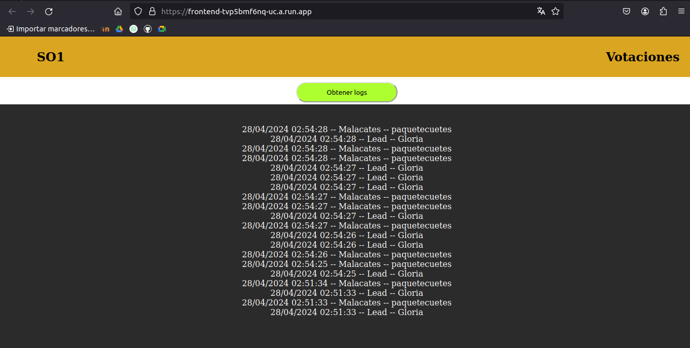
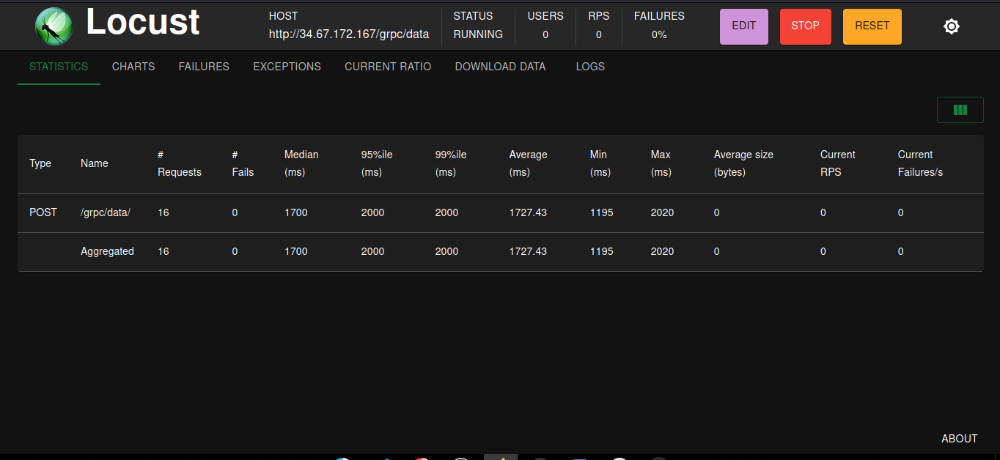

Manuela Técnico
==================

## Introducción 
Los microservicios son un enfoque de arquitectura de software donde una aplicación se divide en pequeños servicios independientes, cada uno ejecutando un proceso único y encapsulando una funcionalidad específica del negocio. Estos servicios son autónomos, lo que significa que pueden ser desarrollados, desplegados y escalados de forma independiente. Generalmente, se comunican entre sí a través de protocolos ligeros como HTTP o mensajes en cola

## Objetivos
- Desarrollar e implementar microservicios para el manejo del trafico dentro de la aplicación.

- Implementar un sistema de mensajería basado en Kafka para el sistema de procesamiento de eventos, permitiendo la transmisión eficiente de grandes volúmenes de datos en tiempo real con latencia mínima.

- Configurar un controlador de Ingress en nuestro clúster de Kubernetes para administrar de manera eficiente el tráfico entrante hacia los servicios desplegados, asegurando una distribución equitativa de las solicitudes entre los pods 

## Microservicios y Grpc
Los microservicios ofrecen una arquitectura flexible y escalable para el desarrollo de aplicaciones distribuidas, mientras que gRPC proporciona una forma eficiente y confiable de comunicarse entre estos servicios, lo que permite construir sistemas distribuidos de alto rendimiento y mantenibilidad.

## Kafka
Kafka está diseñada para manejar grandes volúmenes de datos y proporcionar una infraestructura robusta para la construcción de sistemas distribuidos, justo para nuestro sistema de votaciones.

## Kubernetes
Kubernetes es una plataforma de orquestación de contenedores de código abierto que automatiza la implementación, el escalado y la gestión de aplicaciones contenerizadas. Kubernetes permite gestionar clústeres de contenedores a gran escala de manera eficiente, proporcionando características como la distribución de carga, el autoescalado, la autorreparación y la actualización sin tiempo de inactividad.

### Configuración cluster kafka
Este configura el cluster kafka, tal como los contenendores de zookeper y kafka, asi como los volumenes de cada uno.

### Archivo confgrpc.yaml
Configura el pod de el cliente y servidor gRPC asi como el servicio para el balanceador de carga ingress.

### Archivo consumer.yaml
Crea el pod para el consumer programado en el lenguaje Golang, este no necesita un servicio.

### Archivo deployrust.yaml
Configura el cliente servidor en el lenguaje rust, asi mismo el servicio, ya que este es otro microservicio al que ingress dirigirá el balanceo de carga.

### Archivo grafana.yaml
Configura el contenedor para grafana para asi, visualizar cada uno de los datos.

## Funcionamiento
Aplicacion web desde Cloud Run

Prueba desde locust

